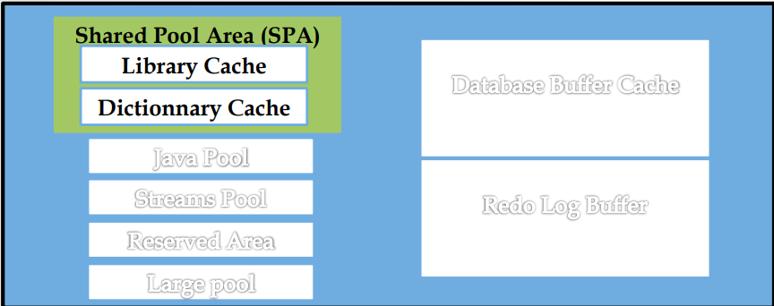

# Résumé ORACLE

# Partie 01:

## **Concepts de Base de Données et SGBD**

- **Base de données** : Collection organisée de données, permettant l'accès rapide et sécurisé par plusieurs utilisateurs.
- **SGBD (Système de Gestion de Base de Données)** :
    - Logiciel qui gère l'organisation et la manipulation des données.
    - Gère le contrôle d'accès, l'optimisation des requêtes et le stockage.
- **Oracle comme SGBD** :
    - **SGBDR** (relationnel) et **SGBDRO** (relationnel-objet).
    - **Editions** :
        - **Enterprise** : Version complète pour les grandes entreprises.
        - **Standard** : Fonctionnalités limitées (jusqu'à 4 processeurs).
        - **Express** : Version gratuite pour les petits projets.

## **Rôle du DBA (Database Administrator)**

- Installation et Configuration.
- Gestion de la Sécurité.
- Optimisation des Performances.
- Sauvegarde et Restauration.
- Planification et Allocation de Ressources.

### **1. Le Noyau de Base d'Oracle**

- **Moteur SQL** : Exécute les commandes de manipulation de données (`SELECT`, `INSERT`, `UPDATE`, `DELETE`) pour interroger et gérer les données.
- **Moteur PL/SQL** : Permet la programmation procédurale avec des structures complexes (procédures, fonctions, triggers) directement dans la base de données.
- **Moteur Java** : Exécute du code Java dans Oracle, permettant l'utilisation d'objets Java pour des applications avancées.
- **Vérification de la Version** : Utiliser `SELECT * FROM PRODUCT_COMPONENT_VERSION` ou la vue `V$version` pour connaître la version Oracle en cours.

## **Architecture d'un Serveur Oracle**

> Un serveur Oracle se compose de deux éléments principaux : **l'instance Oracle** et **la base de données Oracle**. Ensemble, ils assurent la gestion efficace et sécurisée des données.
> 

### **1. Connexion et Session Utilisateur** :

- **Connexion d'un client** : Le client contacte le **listener**, un processus qui écoute les demandes de connexion.
- **Démarrage d’un processus serveur** : Le listener crée un **processus serveur dédié** pour gérer la session utilisateur.
- **Création de session** : Le processus serveur établit une connexion avec l'instance Oracle et crée une session utilisateur.

### **2. Structures Mémoire** :


- **SGA (System Global Area)** :
    
    
    
    - **Database Buffer Cache (50%)** : Cache les données lues ou modifiées pour améliorer les performances en évitant les accès disque.`DB_CACHE_SIZE`
        - **Paramétrage du Database Buffer Cache** :
            - **`DB_BLOCK_BUFFERS`** : Ce paramètre définit le nombre de buffers en mémoire. Chaque buffer est de taille égale à **`DB_BLOCK_SIZE`**.
                - La taille du **Database Buffer Cache** dépend donc du nombre de buffers et de la taille de chaque buffer.
            - **Commandes pour consulter la taille actuelle** :
            
            ```sql
            SELECT COMPONENT, CURRENT_SIZE FROM V$MEMORY_DYNAMIC_COMPONENTS;
            ```
            
        - **Optimisation des Performances du Database Buffer Cache** :
            - **Calcul de l'efficacité** :
                - **R** : Efficacité du cache.
                
                $R = 1 - \frac {Physical~reads}{db ~block~gets ~+~ consistent~gets}$
                
            - **Physical read** : Nombre de lectures effectuées sur disque.
            - **db block gets + consistent gets** : Nombre total de lectures, en mémoire ou sur disque.
        - **Interprétation** :
            - Si **R > 60-70%**, les performances sont bonnes.
            - Si **R < 60%**, la taille du **Database Buffer Cache** pourrait être insuffisante et il peut être nécessaire de l'augmenter.
        - **Commande pour vérifier les statistiques de performance** :
            
            ```sql
            SELECT name, value FROM v$sysstat
            WHERE name IN ('db block gets', 'consistent gets', 'physical reads');
            ```
            
    - **Shared Pool (40%)** : Partage les requêtes SQL et les métadonnées entre utilisateurs `SHARED_POOL_SIZE`. Il se compose de :
        - **Library Cache** : **Stocke les instructions SQL et PL/SQL** récemment utilisées pour les partager entre les processus.
            - **Optimisation du Library Cache** :
                - **pins** : Nombre d'exécutions sans défaut de cache.
                - **reloads** : Nombre de demandes infructueuses dues à l'absence des instructions dans le cache.
                
                Analyse des performances :
                
                ```sql
                SELECT sum(pins) "Executions",
                       sum(reloads) "Défaut de cache",
                       sum(reloads) / (sum(pins) + sum(reloads))*100 "Rapport (R)"
                FROM v$librarycache;
                ```
                
                - Si **R ≤ 1%**, le cache est performant.
                - Si **R > 1%**, augmenter la taille de **SHARED_POOL_SIZE**.
            - Commande pour ajuster la taille :
                
                ```sql
                ALTER SYSTEM SET shared_pool_size=tailleM;
                ```
                
        - **Dictionary Cache** : Contient les informations sur les objets de la base de données.
            - Analyse des performances :
                - Si **R ≤ 10% ou 15%**, le cache est performant.
                - Sinon, augmenter la taille du **SHARED_POOL_SIZE**.
            
            ```sql
            SELECT sum(gets) "Cumul des demandes",
            sum(getmisses) "Cumul des demandes manquées",
            sum(getmisses) / (sum(gets)+sum(getmisses))*100 "Rapport (R)"
            FROM v$rowcache;
            ```
            
            - Commande pour ajuster la taille :`ALTER SYSTEM SET shared_pool_size=60M;`
        - **informations sur les Requêtes** :
            - **`v$sqlarea`** : Contient le texte des requêtes exécutées.
            - **`v$librarycache`** : Liste les requêtes partagées pour optimiser leur réutilisation.
            - **`v$rowcache`** : Fournit des informations sur le dictionnaire d'Oracle (métadonnées).
    - **Redo Log Buffer** : Stocke les modifications avant de les écrire sur disque pour assurer la récupération des transactions. C'est généralement moins de 10% de la SGA.
        - **Optimisation du Redo Log Buffer** :
            - Si le **Redo Log Buffer** est trop petit, des **attentes** peuvent se produire, ce qui ralentit les performances.
            - Pour vérifier si des attentes se produisent, vous pouvez utiliser la commande suivante :
            
            ```sql
            SELECT name, value FROM v$sysstat
            WHERE name = 'redo log space requests';
            ```
            
            - Si **value** est proche de 0, tout va bien.
            - Si **value** augmente fréquemment, il y a probablement des attentes dues à un **Redo Log Buffer trop petit**.
    - **Java Pool** et **Large Pool** : Zones dédiées aux applications Java et aux opérations nécessitant de la mémoire (par exemple, les sauvegardes).
        
        `LARGE_POOL_SIZE`
        
        `JAVA_POOL_SIZE`
        
        `alter system set JAVA_POOL_SIZE =4M;`
        
    
    ### **Paramétrage de la SGA** :
    
    - **SGA_TARGET** : Détermine la taille totale de la SGA.
        - Si configuré à > 0, Oracle gère la mémoire automatiquement.
    - **Dimensionnement** : La SGA doit généralement représenter au moins 2% de la taille de la base de données pour une performance optimale.
    
    ### **Commandes pour ajuster la SGA** :
    
    - **Définir la taille maximale** : `ALTER SYSTEM SET sga_max_size=tailleM SCOPE=SPFILE;`
    - **Définir la taille souhaitée** : `ALTER SYSTEM SET sga_target=tailleM SCOPE=SPFILE;`
    
    ### **Vérification** :
    
    - **Composants de mémoire** : `SELECT COMPONENT, CURRENT_SIZE FROM V$MEMORY_DYNAMIC_COMPONENTS;`
    - **Paramètres actuels de la SGA** : `SHOW PARAMETER sga;`
    - **Configuration complète de la SGA :** `SELECT * FROM v$sga;`
- **PGA (Program Global Area)** :
    
    > une mémoire privée allouée à chaque processus utilisateur pour gérer les informations de session et les requêtes.
    > 
    - **Commandes** :
        - Ajuster la taille : `ALTER SYSTEM SET pga_aggregate_target=100M;`
        - Afficher les composants mémoire : `SELECT COMPONENT, CURRENT_SIZE FROM V$MEMORY_DYNAMIC_COMPONENTS;`
        - Vérifier les paramètres de la PGA : `SHOW PARAMETER pga;`

### **3. Processus d'Arrière-Plan** :

- **SMON (System Monitor)** : Restaure les transactions incomplètes et gère les ressources.
- **PMON (Process Monitor)** : Libère les ressources en cas d’échec de processus utilisateur.
- **DBWn (Database Writer)** : Écrit les modifications dans les fichiers de données.
- **LGWR (Log Writer)** : Enregistre les transactions dans les fichiers redo log.
- **CKPT (Checkpoint)** : Met à jour les fichiers de contrôle pour marquer les points de reprise.
    - `select checkpoint_change#,current_scn from v$database ;`

Liste des processus oracle :

```sql
Select p.pid, [bg.name](http://bg.name/), bg.description, p.program
from v$bgprocess bg, v$process p
where bg.paddr = p.addr
order by p.pid;
```

Lister tous les autres processus d’arrière plan existants

```sql
select * from v$bgprocess where paddr = '00' ;
```

### 4. **Structures Physiques de la Base de Données**

- **Fichiers de données** : Stockent les tables, index et autres objets de la base de données.
- **Fichiers de contrôle** : Contiennent des informations essentielles sur la structure de la base, comme le numéro de version et la liste des fichiers de données et redo logs.
- **Fichiers redo log** : Journalisent toutes les transactions, permettant de restaurer les données en cas de panne.

## **Gestion des Utilisateurs et Droits d'Accès**

- **Création d'Utilisateurs** :
    - Commande : `CREATE USER nom_utilisateur IDENTIFIED BY mot_de_passe;`
    - Chaque utilisateur dispose d'un compte spécifique avec des privilèges adaptés à son rôle.
- **Privilèges** :
    - **Privilèges Système** : Affectent l’ensemble de la base (ex. : `CREATE SESSION`, `CREATE TABLE`).
    - **Privilèges d'Objet** : Concerne des objets précis comme des tables ou vues (ex. : `SELECT`, `INSERT`).
- **Rôles** :
    - Groupes de privilèges assignés aux utilisateurs pour simplifier la gestion des permissions.
    - Exemples :
        - **CONNECT** : Accès de base à la base de données.
        - **RESOURCE** : Permet de créer des objets de développement.
        - **DBA** : Accès complet pour les administrateurs.
    - Commande pour créer un rôle : `CREATE ROLE nom_du_role;`
- **Sécurité et Gestion des Droits** :
    - **Vérification régulière des privilèges** pour limiter les accès excessifs.
    - **Révocation** : Retirer un privilège d’un utilisateur (`REVOKE privilege FROM nom_utilisateur;`).
    - **Authentification** : Peut être configurée pour des options avancées comme LDAP pour renforcer la sécurité.

## **Métiers autour des Bases de Données**

- **Administrateur de Base de Données (DBA)** :
    - Assure l’installation, la sécurité, l’optimisation, les sauvegardes, et la récupération.
- **Responsable de la Sécurité** :
    - Définit et surveille les politiques de sécurité pour protéger les données.
- **Administrateur Réseau** :
    - Gère les connexions réseau pour assurer un accès fiable et sécurisé.
- **Développeur d’Applications** :
    - Conçoit les applications qui utilisent la base de données et optimise les requêtes.
- **Administrateur Système** :
    - Supervise l’infrastructure des serveurs et du stockage, et veille à la disponibilité des ressources.
- **Utilisateurs Finaux** :
    - Accès restreint pour les opérations de base telles que la saisie de données ou la consultation de rapports.

---

# Partie 02:

## **Gestion de l'Instance Oracle**

### **Fichiers de Paramètres**

1. **PFILE (Paramètre Statique)** :
    - Fichier texte modifiable manuellement, situé généralement dans `$ORACLE_HOME/dbs/init<SID>.ora`.
    - **Commandes** :
        - Créer un PFILE à partir d’un SPFILE : `CREATE PFILE='chemin_du_pfile' FROM SPFILE;`
        - Copier un exemple de PFILE : `cp init.ora $ORACLE_HOME/dbs/init<SID>.ora`
        - Modifier manuellement les paramètres en éditant le fichier.
2. **SPFILE (Paramètre Persistant)** :
    - Fichier binaire mis à jour automatiquement par Oracle.
    - **Commandes** :
        - Créer un SPFILE à partir d’un PFILE : `CREATE SPFILE FROM PFILE = 'chemin_du_PFILE';`
        - Afficher le chemin du SPFILE en cours d’utilisation : `SHOW PARAMETER SPFILE;`

### **États de l’Instance**

1. **NOMOUNT** :
    - Allocation de mémoire, lecture des fichiers initiaux.
    - Utilisé pour des tâches comme la création de la base ou le changement de fichiers de contrôle.
    - **Commande** : `STARTUP NOMOUNT;`
2. **MOUNT** :
    - Ouverture des fichiers de contrôle pour la gestion des fichiers physiques.
    - **Commande** : `STARTUP MOUNT;`
3. **OPEN** :
    - Ouverture complète des fichiers de données et mise à disposition pour les utilisateurs.
    - **Commande** : `STARTUP;`

### **Arrêt de l’Instance**

1. **NORMAL** :
    - Attente de déconnexion des utilisateurs avant arrêt.
    - **Commande** : `SHUTDOWN NORMAL;`
2. **IMMEDIATE** :
    - Annulation des transactions actives et déconnexion immédiate des utilisateurs.
    - **Commande** : `SHUTDOWN IMMEDIATE;`
3. **ABORT** :
    - Arrêt forcé sans journalisation ni rollback.
    - **Commande** : `SHUTDOWN ABORT;`

## **Structure Physique de la Base de Données**

- **Fichiers de Données** :
    - Contiennent les données réelles de la base, chaque fichier est lié à un tablespaces.
    - **Tablespaces minimums requis à la création** :
        1. **SYSTEM** :
            - Contient le dictionnaire de données (métadonnées de la base).
        2. **SYSAUX** :
            - Tablespace auxiliaire au SYSTEM, destiné à stocker certaines fonctions Oracle (ex. : statistiques, journaux).
        3. **TEMP (Temporaire)** :
            - Utilisé pour les opérations nécessitant des segments temporaires, comme le tri ou les requêtes complexes.
        4. **UNDO** :
            - Stocke les versions précédentes des données pour permettre des annulations de transactions (ROLLBACK).
        5. **USERS** :
            - Tablespace par défaut pour le stockage des objets des utilisateurs (tables, index, etc.).
    - Liste des fichiers actuels : `SELECT NAME FROM V$DATAFILE;`
- **Fichiers de Redo Log (.redo, .log)** :
    - Enregistrent les modifications pour permettre la récupération après une panne.
    - **Redo Log Archivés**:
        - Archives des anciens fichiers Redo Log, nécessaires pour les restaurations à des points précis.
    - **Commandes** :
        - Ajouter un groupe : `ALTER DATABASE ADD LOGFILE GROUP <n> ('chemin/logfile') SIZE 5000K;`
        - Supprimer un groupe : `ALTER DATABASE DROP LOGFILE GROUP <n>;`
        - Forcer un basculement de groupe : `ALTER SYSTEM SWITCH LOGFILE;`
        - `V$LOG` : informations sur les groupes
        - `V$LOGFILE` : informations sur les membres
- **Fichiers de Contrôle** (.ctl) :
    - Métadonnées essentielles (nom de la base, emplacements des fichiers) pour la gestion de la base de données.
    - **Commandes** :
        - Sauvegarder un fichier de contrôle : `ALTER DATABASE BACKUP CONTROLFILE TO '<nom_du_fichier>';`
        - Vérifier les fichiers actuels : `SELECT NAME FROM V$CONTROLFILE;`
        - Statut des fichiers de contrôle: `Show parameter control_files;`

## **Structure Logique de la Base de Données**

1. **Tablespaces** :
    - Organisation logique des données, chaque tablespace est stocké dans un ou plusieurs fichiers de données.
    
    | **Type de Tablespace** | **Usage Principal** | **Particularités** |
    | --- | --- | --- |
    | **SYSTEM** | Métadonnées (dictionnaire de données) | Obligatoire, contient les informations critiques de la base, ne peut pas être mis hors ligne. |
    | **SYSAUX** | Données auxiliaires | Complément à SYSTEM, stocke les composants auxiliaires (statistiques, journaux internes, outils Oracle). |
    | **TEMP** | Segments temporaires | Utilisé pour des requêtes complexes (`ORDER BY`, `GROUP BY`, `UNION`). Ne conserve pas de données persistantes. |
    | **UNDO** | Gestion des transactions | Stocke les versions antérieures des données pour le ROLLBACK et garantit la cohérence des lectures. |
    | **USERS** | Objets utilisateur (tables, index) | Tablespace par défaut pour les utilisateurs non-systèmes, configurable avec des quotas. |
    | **BIGFILE** | Stockage de très grandes bases | Permet un seul fichier jusqu'à 128 To, simplifie la gestion des fichiers pour les bases volumineuses. |
    | **SYSTEM_READ_ONLY** | Métadonnées en mode lecture seule | Spécifique à certaines opérations où SYSTEM peut être mis temporairement en lecture seule. |
    | **PERMANENT** | Stockage durable des objets | Catégorie générique incluant SYSTEM, SYSAUX et USERS. |
    | **DEFAULT** | Tablespace par défaut | Peut être configuré pour un utilisateur si aucun tablespace n’est spécifié lors de la création d’un objet. |
    - **Commande Générale** :
    
    ```sql
    CREATE [ BIGFILE | SMALLFILE ] TABLESPACE Ts_nom
    DATAFILE 'nom_fichier' [ SIZE valeur [K|M|G|T] ] [REUSE]
    AUTOEXTEND { OFF | ON [ NEXT valeur [K|M|G|T] ]
    [ MAXSIZE { UNLIMITED | valeur [K|M|G|T] } ] }
    EXTENT MANAGEMENT
    LOCAL { AUTOALLOCATE | UNIFORM [ SIZE valeur [K|M|G|T] ] }
    SEGMENT SPACE MANAGEMENT { MANUAL | AUTO }
    [ BLOCKSIZE valeur (K) ]
    [ LOGGING | NOLOGGING ]
    [ FORCE LOGGING ]
    [ ONLINE | OFFLINE ];
    ```
    
    - **Paramètres Principaux** :
        - **DATAFILE** : Définit les fichiers de données associés au tablespace (emplacement, taille, etc.).
        - **AUTOEXTEND** :
            - **ON** : Permet au fichier de données de croître automatiquement.
            - **OFF** : Taille fixe du fichier.
        - **NEXT** : Taille minimale allouée lors d’une extension.
        - **MAXSIZE** : Taille maximale autorisée pour le fichier, ou **UNLIMITED** pour une taille illimitée.
        - **EXTENT MANAGEMENT** :
            - **AUTOALLOCATE** : Oracle gère automatiquement la taille des extents.
            - **UNIFORM** : Taille des extents fixe (par défaut 1 Mo).
        - **SEGMENT SPACE MANAGEMENT** :
            - **AUTO** : Oracle gère automatiquement l’espace libre.
            - **MANUAL** : Gestion manuelle de l’espace libre.
        - **BLOCKSIZE** : Définit la taille des blocs utilisés par le tablespace. Valeurs possibles : **2 Ko, 4 Ko, 8 Ko, 16 Ko, 32 Ko**.
        - **LOGGING | NOLOGGING** :
            - **LOGGING** : Segments enregistrés dans les redo logs (par défaut).
            - **NOLOGGING** : Exclut les segments des redo logs pour réduire la journalisation.
        - **FORCE LOGGING** : Forcer l’enregistrement des segments dans les redo logs, même si `NOLOGGING` est défini.
        - **ONLINE | OFFLINE** :
            - **ONLINE** : Le tablespace est accessible.
            - **OFFLINE** : Le tablespace est inaccessible.
    - **Commandes** :
        - **Création d'un Tablespace**
            - **Permanent** :
                
                ```sql
                CREATE TABLESPACE users
                DATAFILE '/path_to_file/users01.dbf' SIZE 50M AUTOEXTEND ON;
                ```
                
            - **Temporaire** :
                
                ```sql
                CREATE TEMPORARY TABLESPACE temp
                TEMPFILE '/path_to_file/temp01.dbf' SIZE 50M AUTOEXTEND ON;
                ```
                
            - **UNDO** :
                
                ```sql
                CREATE UNDO TABLESPACE undotbs
                DATAFILE '/path_to_file/undo01.dbf' SIZE 100M AUTOEXTEND ON;
                ```
                
        - **Modification d’un Tablespace**
            - **Ajouter un fichier de données** :
                
                ```sql
                ALTER TABLESPACE users ADD DATAFILE '/path_to_file/users02.dbf' SIZE 50M;
                ```
                
            - **Modifier la taille d’un fichier** :
                
                ```sql
                ALTER DATABASE DATAFILE '/path_to_file/users01.dbf' RESIZE 100M;
                ```
                
            - **Mettre un tablespace en ligne ou hors ligne** :
                
                ```sql
                ALTER TABLESPACE users OFFLINE;
                ALTER TABLESPACE users ONLINE;
                ```
                
        - **Suppression d’un Tablespace**
            - Supprimer un tablespace et son contenu :
                
                ```sql
                DROP TABLESPACE users INCLUDING CONTENTS AND DATAFILES;
                ```
                
        - Vérifier les tablespaces :
            
            ```sql
            SELECT TABLESPACE_NAME FROM DBA_TABLESPACES;
            ```
            

## **Création d’une Base de Données**

1. **Création avec SQL :**
    - Commande `CREATE DATABASE` permet de définir tous les éléments nécessaires :
        
        ```sql
        CREATE DATABASE nom_base
        USER SYS IDENTIFIED BY mot_de_passe
        USER SYSTEM IDENTIFIED BY mot_de_passe
        LOGFILE GROUP 1 ('chemin/log1.log') SIZE 100M,
                GROUP 2 ('chemin/log2.log') SIZE 100M
        MAXDATAFILES 100
        DATAFILE 'chemin/system01.dbf' SIZE 325M AUTOEXTEND ON;
        ```
        
2. **Via l’Outil DBCA :**
    - Interface graphique pour simplifier la création et la configuration de bases Oracle.

## **Commandes Clés pour la Gestion**

- **Vérification des Paramètres de la Base :**
    
    ```sql
    SHOW PARAMETER;
    ```
    
- **Afficher la Configuration Actuelle de la Mémoire :**
    
    ```sql
    SELECT COMPONENT, CURRENT_SIZE FROM V$MEMORY_DYNAMIC_COMPONENTS;
    ```
    
- **Informations sur les Tablespaces :**
    
    ```sql
    SELECT * FROM DBA_TABLESPACES;
    SELECT * FROM V$TABLESPACE;
    ```
    

---

# Partie 03:

## **Gestion des Utilisateurs**

### **Création d'un Utilisateur**

1. **Paramètres de création** :
    - Définir un nom d'utilisateur et un mot de passe.
    - Spécifier les tablespaces par défaut et temporaire.
    - Définir les quotas sur les tablespaces.
2. **Commandes** :
    - Création avec authentification par la base de données :
        
        ```sql
        CREATE USER scott IDENTIFIED BY tiger
        DEFAULT TABLESPACE users
        TEMPORARY TABLESPACE temp
        QUOTA 10M ON users;
        ```
        
    - Création avec authentification par le système d’exploitation :
        
        ```sql
        CREATE USER scott IDENTIFIED EXTERNALLY;
        ```
        
3. **Gestion des erreurs** :
    - En cas de l'erreur `ORA-65096`, exécuter :
        
        ```sql
        ALTER SESSION SET "_ORACLE_SCRIPT"=true;
        ```
        

### **Modification d'un Utilisateur**

- **Modifier le mot de passe** :
    
    ```sql
    ALTER USER scott IDENTIFIED BY new_password;
    ```
    
- **Modifier les quotas** :
    
    ```sql
    ALTER USER scott QUOTA 15M ON users;
    ```
    
- **Changer les tablespaces par défaut** :
    
    ```sql
    ALTER USER scott DEFAULT TABLESPACE data TEMPORARY TABLESPACE temp_data;
    ```
    
- **Verrouiller ou déverrouiller un compte** :
    
    ```sql
    ALTER USER scott ACCOUNT LOCK;
    ALTER USER scott ACCOUNT UNLOCK;
    ```
    

### **Suppression d'un Utilisateur**

- Supprimer un utilisateur avec un schéma vide :
    
    ```sql
    DROP USER scott;
    ```
    
- Supprimer un utilisateur avec toutes ses données :
    
    ```sql
    DROP USER scott CASCADE;
    ```
    

## **Rôles et Privilèges**

### **Privilèges Système**

Permettent à un utilisateur d'exécuter des actions spécifiques sur l'ensemble de la base de données, telles que la création d'objets ou la gestion des utilisateurs.
    


`WITH ADMIN OPTION` : donne à l'utilisateur ou au rôle destinataire le droit de réattribuer ces privilèges ou rôles à d'autres utilisateurs ou rôles.

- **Privilèges liés à la Base de Données**

| **Privilège** | **Description** |
| --- | --- |
| `ALTER DATABASE` | Permet de modifier les paramètres ou l'état de la base de données. |
| `ALTER SYSTEM` | Autorise l'exécution de la commande `ALTER SYSTEM` pour gérer les paramètres. |
- **Privilèges liés aux Sessions**

| **Privilège** | **Description** |
| --- | --- |
| `CREATE SESSION` | Autorise un utilisateur à se connecter à la base de données. |
| `ALTER SESSION` | Permet à l'utilisateur de modifier les paramètres de sa session. |
- **Privilèges liés aux Tables**

| **Privilège** | **Description** |
| --- | --- |
| `CREATE TABLE` | Permet de créer des tables dans le schéma de l'utilisateur. |
| `CREATE ANY TABLE` | Permet de créer des tables dans n'importe quel schéma de la base. |
| `ALTER ANY TABLE` | Autorise la modification des tables ou vues dans n'importe quel schéma. |
| `DROP ANY TABLE` | Permet la suppression des tables dans n'importe quel schéma. |
| `SELECT ANY TABLE` | Autorise la consultation des tables, vues ou vues matérialisées dans n'importe quel schéma. |
- **Privilèges liés aux Tablespaces**

| **Privilège** | **Description** |
| --- | --- |
| `CREATE TABLESPACE` | Autorise la création de nouveaux tablespaces. |
| `ALTER TABLESPACE` | Permet la modification des tablespaces existants (par exemple, redimensionnement). |
| `DROP TABLESPACE` | Permet de supprimer des tablespaces. |
| `UNLIMITED TABLESPACE` | Donne un quota illimité à l'utilisateur sur tous les tablespaces. |
- Exemple: connexion à la base :
    
    ```sql
    GRANT CREATE SESSION TO scott
    ```
    
- **Retrait de privilèges système** :
    
    ```sql
    REVOKE CREATE SESSION FROM scott;
    ```
    

### **Privilèges Objet**

Donnent à un utilisateur des permissions spécifiques pour accéder ou manipuler des objets (comme des tables, vues, séquences, etc.) appartenant à un autre utilisateur.


**`schema.object`**: Définit l'objet sur lequel le privilège est accordé. Cela peut être une table, une vue, un index, etc.

- `schema` : Le schéma (propriétaire de l'objet).
- `object` : Le nom de l'objet

| **Privilège** | **Description** |
| --- | --- |
| **`ALTER`** | Permet de modifier la définition ou la structure d'une table (ajouter/supprimer des colonnes, changer des contraintes, etc.). |
| **`DELETE`** | Autorise la suppression de lignes spécifiques dans la table. |
| **`INSERT`** | Permet d'insérer de nouvelles lignes dans une table. |
| **`REFERENCES`** | Autorise la création de contraintes d'intégrité référentielle (clé étrangère). |
| **`SELECT`** | Permet d'interroger la table pour lire les données. |
| **`UPDATE`** | Autorise la mise à jour des lignes existantes dans la table. |
- Autoriser les opérations sur une table :
    
    ```sql
    GRANT SELECT, INSERT, UPDATE ON hr.employees TO scott;
    ```
    
- Limiter à des colonnes spécifiques :
    
    ```sql
    GRANT UPDATE (name, salary) ON hr.employees TO scott;
    ```
    
1. **Retrait de privilèges objet** :
    
    ```sql
    REVOKE SELECT ON hr.employees FROM scott;
    ```
    

### **Rôles**

1. **Créer et attribuer des rôles** :
    - Créer un rôle :
        
        ```sql
        CREATE ROLE manager_role;
        ```
        
    - Attribuer des privilèges au rôle :
        
        ```sql
        GRANT SELECT, INSERT ON hr.employees TO manager_role;
        ```
        
    - Attribuer le rôle à un utilisateur :
        
        ```sql
        GRANT manager_role TO scott;
        ```
        
2. **Visualiser les rôles et privilèges** :
    - Liste des rôles attribués :
        
        ```sql
        SELECT * FROM DBA_ROLE_PRIVS WHERE GRANTEE = 'SCOTT';
        ```
        
    - Liste des privilèges objet :
        
        ```sql
        SELECT * FROM DBA_TAB_PRIVS WHERE GRANTEE = 'SCOTT'
        ```
        
3. **Suppression d'un rôle** :
    
    ```sql
    DROP ROLE manager_role;
    ```
    

## **Gestion des Profils**

### **Création d’un Profil**

1. **Objectif** :
    - Limiter les ressources système pour chaque utilisateur.
    - Gérer la sécurité des mots de passe.
2. **Commandes** :
    - Créer un profil avec des limites :
        
        ```sql
        CREATE PROFILE my_profile
        LIMIT
           FAILED_LOGIN_ATTEMPTS 5
           PASSWORD_LOCK_TIME 1
           PASSWORD_LIFE_TIME 90
           PASSWORD_GRACE_TIME 10
           SESSIONS_PER_USER 2
           CONNECT_TIME 60
           IDLE_TIME 10
           LOGICAL_READS_PER_SESSION 1000
           PRIVATE_SGA 10M;
        ```
        
    - Appliquer un profil à un utilisateur :
        
        ```sql
        ALTER USER scott PROFILE app_user;
        ```
        

### **Paramètres Importants des Profils**

1. **Limitations du mot de passe :**
    
    **Paramètres de gestion des échecs de connexion :**
    
    - **`FAILED_LOGIN_ATTEMPTS`** :
        - Définition : Nombre maximal de tentatives de connexion infructueuses.
        - Conséquence : Une fois ce nombre atteint, le compte est **verrouillé temporairement**.
    - **`PASSWORD_LOCK_TIME`** :
        - Définition : Durée pendant laquelle un compte reste verrouillé après avoir atteint le seuil défini par `FAILED_LOGIN_ATTEMPTS`.
        - Valeurs possibles :
            - **En jours** (exemple : 1 = 24 heures).
            - **Fractionnaire** (exemple : 30/1440 pour 30 minutes).
            - **`UNLIMITED`** : Verrouillage permanent nécessitant une intervention d'un administrateur.
    
    **Paramètres de gestion de la durée du mot de passe :**
    
    - **`PASSWORD_LIFE_TIME`** :
        - Définition : Durée maximale d'utilisation d'un mot de passe (en jours).
        - Action : Une fois expiré, l'utilisateur est invité à changer son mot de passe.
    - **`PASSWORD_GRACE_TIME`** :
        - Définition : Période de grâce (en jours) après expiration du mot de passe, pendant laquelle l'utilisateur peut se connecter et doit le changer.

**2. Limitations des ressources système :**

**Paramètres liés aux sessions :**

- **`SESSIONS_PER_USER`** :
    - Définition : Nombre maximal de sessions simultanées qu'un utilisateur peut ouvrir.
- **`CONNECT_TIME`** :
    - Définition : Durée maximale d'une session active (en minutes).
    - Action : La session est automatiquement déconnectée une fois le temps atteint.
- **`IDLE_TIME`** :
    - Définition : Durée maximale d'inactivité d'une session (en minutes).
    - Action : Déconnexion automatique si l'utilisateur reste inactif au-delà du délai.

**Paramètres liés à la lecture des données :**

- **`LOGICAL_READS_PER_SESSION`** :
    - Définition : Nombre maximal de blocs (en mémoire et sur disque) qu'une session peut lire.
    - Utilisation : Limite les ressources consommées par une session.

**Paramètre lié à la mémoire privée :**

- **`PRIVATE_SGA`** :
    - Définition : Taille maximale de mémoire privée (en Ko ou Mo) qu'une session peut utiliser.
    - Utilisation : Limite la mémoire consommée pour chaque session.

### **Gestion des Profils**

- Afficher les profils existants et leurs limites :
    
    ```sql
    SELECT PROFILE, RESOURCE_NAME, LIMIT FROM DBA_PROFILES;
    ```
    
- Vérifier le profil attribué à un utilisateur :
    
    ```sql
    SELECT USERNAME, PROFILE FROM DBA_USERS WHERE USERNAME = 'SCOTT';
    ```