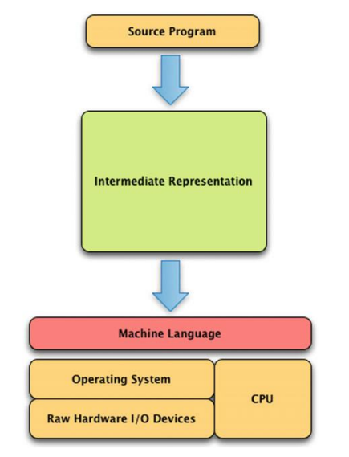
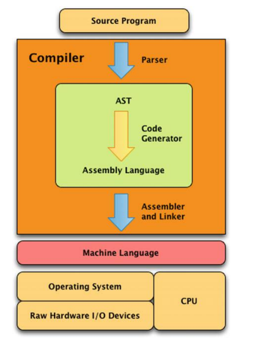
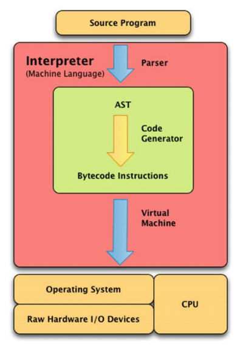
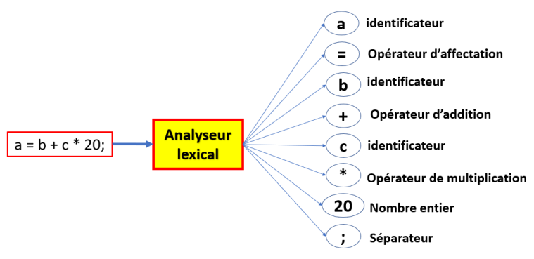
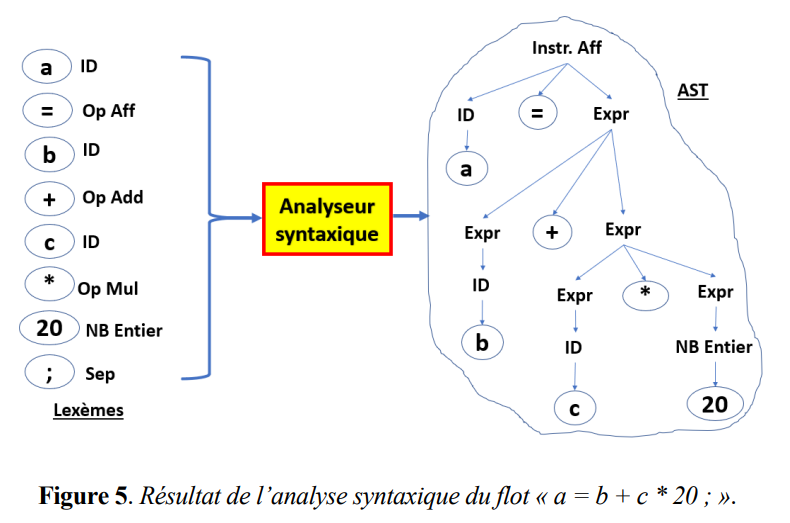
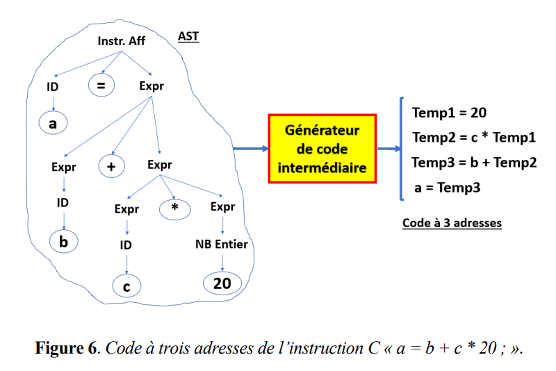
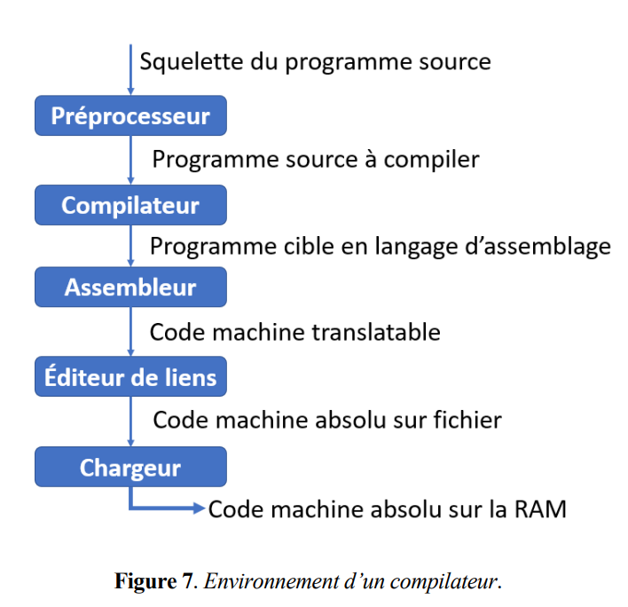
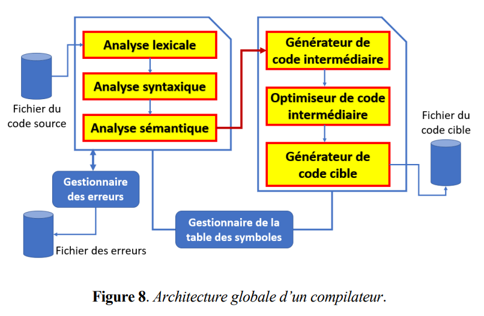

# Théorie de la Compilation

## Introduction à la Compilation

### 1. Langages de Programmation

- **Objectif :** Permettre d’écrire des programmes exécutables par une machine.

- **Évolution :** Du langage machine (instructions primitives) aux langages de haut niveau (C, Java, Python) plus abstraits.

- **Critères de conception :**
    - **Syntaxe** et **sémantique** claires.
    - **Fiabilité**: fonctionnement correct.
    - **Traduction rapide**: traduit ou interprété rapidement.
    - Code objet **optimisé** et **efficace**.
    - **Ortogonalité**: peu de règles spéciales.
    - **Portabilité**: fonctionne sur différentes machines.
    - **Preuvabilité**: vérification formelle de la correction.

- **Principaux Paradigmes des Langages de Programmation :**
    - **Impérative :**
        - Le programme est décomposé en étapes (instructions) et modules via des sous-programmes (routines ou procédures).
        - Exemples : Fortran, Algol, Pascal, C, Cobol.
    - **Fonctionnelle :**
        - Le programme est constitué d’un ensemble de fonctions, favorisant l'absence d'états mutables.
        - Exemples : Haskell, Caml, LISP, Scheme.
    - **Logique :**
        - Le programme se définit par une description de faits (propositions logiques) et des règles d’inférence.
        - Exemple : Prolog.
    - **Orientée-objet :**
        - Le programme s’organise en objets qui encapsulent données et méthodes, limitant l’accès aux données via des méthodes.
        - Exemples : Java, C++, Python.
- **Avantages des Langages de Haut Niveau :**
    - Le langage machine (et même le langage assembleur) est difficile à utiliser et difficile à maintenir.
    - Indépendance vis-à-vis du matériel, évitant la nécessité de former les programmeurs pour chaque nouvelle architecture.
    - Support de l’abstraction de données et de programmes via des structures, procédures et fonctions.
    - Concentration sur la résolution du problème plutôt que sur les détails de la machine.

- **Inconvénients des Langages de Haut Niveau :**
    - Contrôle réduit des ressources matérielles (registres, interruptions, E/S).
    - Dépendance à un compilateur pouvant parfois générer du code moins efficace (améliorations notables avec le temps).

### 2. Compilation vs Interprétation vs Traduction
- **Contexte Général**
    - **Exécution Machine:** Un ordinateur ne peut exécuter que des instructions de son langage machine (opérations simples du CPU comme charger, stocker, additionner, comparer, brancher, etc.).
    - **But des Implémentations:** Transformer le code source en une représentation intermédiaire, puis en code machine exécutable.

        

- **Compilation**
    - **Définition :** Un compilateur traduit un fichier source écrit en un langage de haut niveau (comme C ou Pascal) en un fichier exécutable.
    - **Processus :**
        - **Analyse syntaxique :** Le code source est transformé en un arbre de syntaxe abstraite (**AST**).
        - **Génération de code :** L’AST est parcouru pour produire du code en langage **assembleur**, proche du code machine.
        - **Assemblage et édition de liens :** Le code assembleur est converti en langage machine pour produire le programme final.

            

    - **Exemple :** Le compilateur GCC traduit un programme C (affichant "hello world!") en code assembleur.
    - **Exemple de langages compilés :** C, C++, Rust, Pascal, Fortran, Cobol.

- **Interprétation**
    - **Définition :** Un interpréteur lit et exécute le code source instruction par instruction, sans générer de fichier en langage machine.
    - **Processus :**
        - Le code source est analysé pour créer un **AST**.
        - Parfois, l’AST est transformé en une forme de niveau inférieur, souvent appelée bytecode.
        - Une machine virtuelle exécute ce **bytecode**.

            
        
    - **Exemples :** Les interpréteurs de Java et Python qui produisent et exécutent du bytecode.
    - **Remarque :** Certains interpréteurs, comme ceux de JavaScript avant V8, n’utilisaient pas de bytecode.
    - **Exemple de langages interprétés :** Python, Ruby, JavaScript, Java (avec la JVM), Lisp, Perl, Prolog, PHP.

- **Traduction**
    - **Définition :** Un traducteur convertit le code source d’un langage vers un autre, sans forcément produire du code machine.
    - **Exemples :**
        - Un transpileur TypeScript vers JavaScript.
        - Un assembleur qui transforme du code d’assemblage en code machine.

### 3. Phases d’un Compilateur
Le processus de compilation se divise en deux grandes phases :

- **Phase d’analyse (front-end)** : Convertit le code source en une représentation intermédiaire (AST).

    - **Analyse lexicale (scanning) :** analyse le code source pour le transformer en lexèmes par l'**analyseur lexical**.
        - Parcourt le code source caractère par caractère.
        - Regroupe les caractères en **lexèmes** (tokens) représentant des **unités lexicales**.
        - **Lexèmes** : une suite de caractères ayant un sens dans le langage source.
        - **Unité de lexème** : une classe de lexèmes 
        - **les principales unités lexicales** : mots-clés (if, else ...), identificateurs, littéraux (nombres, chaînes de caractères ...),separateurs (espaces, tabulations, retours à la ligne ...), opérateurs (+, -, *, / ...), commentaires ... .
        - **Exemple** : 
            
            
        
        - Ignore les commentaires et peut détecter des **erreurs lexicales** (ex: un identificateur incorrect, un symbole non valide ou une constante incorrecte).
    - **Analyse syntaxique (parsing) :** analyse les lexèmes pour vérifier la syntaxe du code source par l'**analyseur syntaxique**.
        - Transforme le flux de lexèmes en une série d’**unités syntaxiques** (expressions, déclarations, instructions).
        - Construit un **arbre de syntaxe abstraite** (AST) basé sur la grammaire formelle du langage.

            
    
        - Identifie les erreurs de syntaxe (par exemple, parenthèses manquantes ou points-virgules oubliés).
    - **Analyse sémantique :**
        - Vérifie la cohérence des types et la validité des constructions (exemple : vérification des indices dans un tableau ou détection de division par zéro).
        - Collecte des informations de type pour assurer la correction du programme.

- **Phase de synthèse (back-end)** : Convertit la représentation intermédiaire en code machine.

    - **Génération du code intermédiaire :** 
        - Convertit l’**AST** en une **représentation intermédiaire**, souvent sous la forme de **code à trois adresses**.
        - Cette forme facilite la traduction ultérieure vers le code cible.

            
        
    - **Optimisation du code intermédiaire :**
        - Améliore le code pour le rendre plus efficace en mémoire et en temps d’exécution.
        - Par exemple, simplifier des séquences d’instructions.

            
        
    - **Génération du code cible :**
        - Traduit le code intermédiaire optimisé en code machine ou en langage d’assemblage.
        - Gère l’affectation des variables aux registres et l’allocation de la mémoire pour produire un programme exécutable.

            

### 4. Environnement d’un Compilateur
La création d’un code exécutable ne repose pas uniquement sur le compilateur, mais nécessite également divers outils complémentaires :

- **Préprocesseur :**
    - Effectue des tâches préparatoires (par exemple, inclusion de fichiers avec `#include` ou définitions de macros avec `#define`).

- **Assembleur :**
    - Convertit le code en langage d’assemblage en code binaire exécutable.

- **Éditeur de liens (Linker) :**
    - Fusionne le code machine généré par le compilateur avec celui provenant des bibliothèques pour former un code **machine absolu**.

- **Chargeur (Loader) :**
    - Charge le code machine dans la mémoire principale (RAM) en ajustant les adresses si nécessaire.

En plus de ces programmes, d’autres outils jouent un rôle crucial dans le développement d’un programme :

- **Éditeur de texte :**
    - Pour saisir et enregistrer le code source.

- **Débogueur :**
    - Pour détecter et corriger les erreurs pendant le développement.

### 5. Architecture Globale

- **Enregistrement des lexèmes :**
    - Le compilateur collecte et enregistre des informations pour chaque lexème (par exemple, la position dans le fichier, le type d’un identificateur, ou la valeur initiale d’une variable).

- **Table des symboles :**
    - Ces informations sont stockées dans une table de hachage appelée **table des symboles**, qui contient une entrée par lexème avec divers attributs.
    - Le module responsable de la gestion de cette table est le **gestionnaire de la table des symboles**.

- **Gestionnaire d'erreurs :**
    - Un module dédié s'occupe de détecter et de gérer les erreurs survenant durant la compilation.

### 6. Caractéristiques d’un Bon Compilateur

- **Correction :** Génère du code conforme aux spécifications du langage et respecte le comportement attendu.

- **Efficacité :** Produit un code exécutable performant en termes de vitesse et d’utilisation des ressources (CPU, mémoire).

- **Temps de réponse rapide :** Doit compiler rapidement pour rester utile dans le développement moderne.

- **Traitement efficace des erreurs :** Détecte un maximum d’erreurs (syntaxiques, sémantiques, d’exécution) en un seul passage.

- **Messages d’erreur clairs :** Fournit des messages compréhensibles qui aident le développeur à résoudre les problèmes.

- **Modularité et extensibilité :** Facilite l’ajout de nouvelles fonctionnalités et le support de langages supplémentaires.

- **Interface utilisateur conviviale :** Offre une interface ergonomique et simple d’utilisation.

- **Gestion des dépendances :** Capable de gérer des projets complexes composés de plusieurs fichiers et bibliothèques.

- **Documentation et support :** Dispose d’une bonne documentation et d’un support actif (communauté ou assistance).
