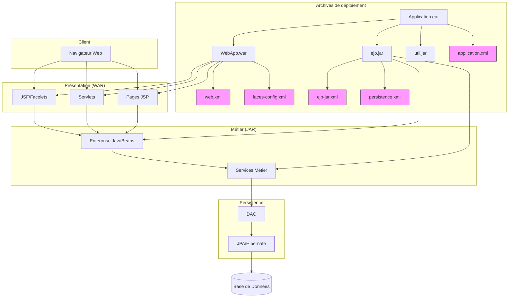

```mermaid
graph TB
    %% Client
    client[Navigateur Web]
    
    %% Archives de déploiement
    ear[Application.ear]
    war[WebApp.war]
    jar1[ejb.jar]
    jar2[util.jar]
    
    %% Fichiers de configuration XML
    appxml[application.xml]
    webxml[web.xml]
    facesxml[faces-config.xml]
    ejbxml[ejb-jar.xml]
    persxml[persistence.xml]
    
    %% Composants applicatifs
    pres1[Pages JSP]
    pres2[Servlets]
    pres3[JSF/Facelets]
    
    bus1[Enterprise JavaBeans]
    bus2[Services Métier]
    
    dao1[JPA/Hibernate]
    dao2[DAO]
    
    db[(Base de Données)]
    
    %% Regroupement par couches
    subgraph "Client"
        client
    end
    
    subgraph "Archives de déploiement"
        ear --> war
        ear --> jar1
        ear --> jar2
        ear --> appxml
        war --> webxml
        war --> facesxml
        jar1 --> ejbxml
        jar1 --> persxml
    end
    
    subgraph "Présentation (WAR)"
        war --> pres1
        war --> pres2
        war --> pres3
    end
    
    subgraph "Métier (JAR)"
        jar1 --> bus1
        jar1 --> bus2
    end
    
    subgraph "Persistence"
        dao1
        dao2
    end
    
    %% Relations entre composants
    client --> pres1
    client --> pres2
    client --> pres3
    
    pres1 & pres2 & pres3 --> bus1
    bus1 --> bus2
    bus2 --> dao2
    dao2 --> dao1
    dao1 --> db

    %% Style pour les fichiers XML
    classDef xmlFile fill:#f9f,stroke:#333
    class appxml,webxml,facesxml,ejbxml,persxml xmlFile
```